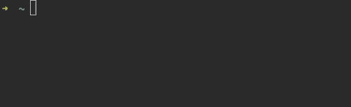
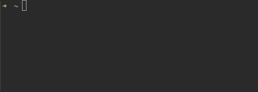
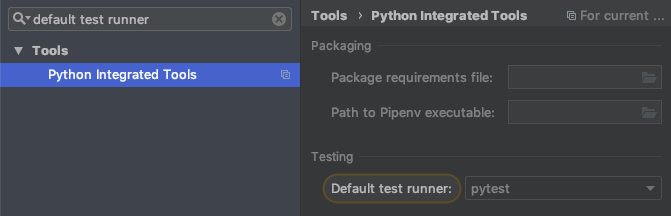
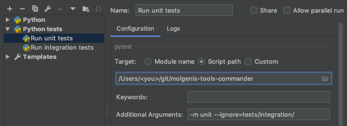

[](https://sonarcloud.io/dashboard?id=org.molgenis%3Acommander)

# MOLGENIS Commander

MOLGENIS Commander makes managing your [MOLGENIS application](https://molgenis.github.io//) a breeze! It offers a rich set of commands for oft-repeated actions
like importing datasets and managing groups and users. Besides catering to the data oriented user it also aims to provide 
an extensive toolkit for developers working on MOLGENIS.

### Teaser

Easily add groups and users and configure their roles:


Import datasets with a single command:



Tie it all together by creating a script:



For a full list of features, go:

```
mcmd --help
```

### How to install

Make sure you have Python 3.7 or higher installed and in a terminal, run:

```
pip install molgenis-commander
```

If you have also have Python 2.x installed on your machine (common for machines running MacOs), make sure to install the commander with the Python 3 version of `pip`:

```
pip3 install molgenis-commander
```

#### Upgrading

To upgrade to the newest version, run:

```
pip install --upgrade molgenis-commander
```

Or if you have both Python 2 and 3 installed, run:

```
pip3 install --upgrade molgenis-commander
```

#### Troubleshooting
> I've installed the commander with pip but when I run `mcmd` I get a stacktrace referencing Python 2.x

You've installed the commander with an old version of `pip`. Make sure your Python version is up to date (3.7 or higher) and that you've installed with the correct version of `pip`.


### Writing scripts

It's possible to collect multiple commands in a script. For simple scripts, you can use the `mcmd script` command which 
lets you compose a script from commands you've run previously. Of course, you can also use a text editor. Just make sure
to save the script (without extension) under `~/.mcmd/scripts/`. 

Here's an example of a script:

```
# Imports
add package test
import my_dataset --in test

# Change application settings
set app title "My MOLGENIS"
set dataexplorer searchbox false
$wait Please change the layout of the menu to your liking

# Cleanup
delete --force --package test
```

#### Running scripts

Scripts can be run with the `mcmd run` command. 

#### Script functions
##### $wait
`$wait` simply waits for the user to press enter. The message next to `$wait` will be displayed and can be used to 
instruct the user to do something the commander can't (yet).
 

### Development
Want to help out? Fork and clone this repository, go to the root of the project and create a virtual environment:

```
python -m virtualenv env
```

Now activate the environment. How to do this depends on your operating system, read 
[the virtualenv docs](https://virtualenv.pypa.io/en/latest/userguide) for more info. 
The following example assumes MacOS:


```
source env/bin/activate
```

Then install the project in development mode:
```
pip install -e .
```

The `mcmd` command will now be available in this virtual environment! If you want to
leave the environment, use `deactivate`.

### Running tests
The project contains unit- and integration tests. 

#### Running tests from the command line
To run all the unit tests from the command line, go:

```
python setup.py test --addopts "-m unit --ignore=tests/integration/" 
```

The integration tests require a running MOLGENIS application to test against. They can be run like this:
 
```
python setup.py test --addopts "-m integration --ignore=tests/unit/"
```
 
By default the localhost is chosen (username: admin, password: admin), but it's possible to configure a different server:

```
python setup.py test --addopts "-m integration --ignore=tests/unit/ --url=<your_url> --username=<admins username> --password=<admins password>" 
```

#### Running tests in PyCharm
To run the tests in PyCharm, first set the default test runner to 'pytest'. 



Then create pytest run configurations, by going to `Edit Configurations -> + -> Python tests -> pytest` and using
the same arguments as above:




